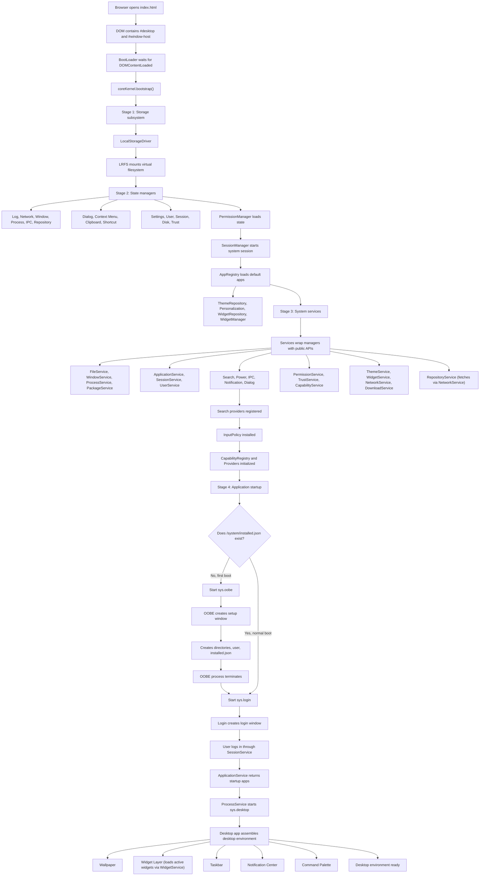
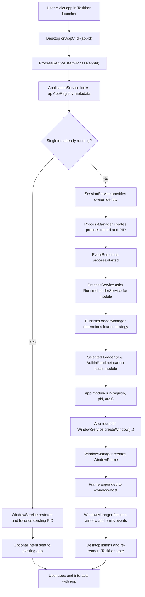
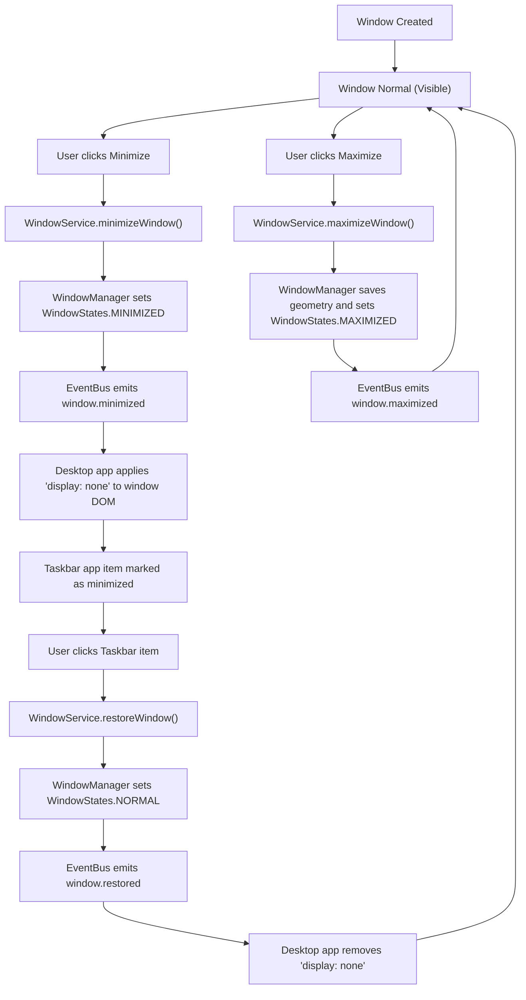
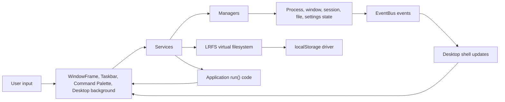

# LDE Startup And Desktop Environment Flow

This diagram traces LDE from a blank browser page to a running desktop environment, then shows how launching and interacting with applications flows through the system.

## Zero To Desktop Environment

## Running An Application

## Window Lifecycle

## Interaction Loop

## Main Responsibilities

| Layer | Files | Role |
| --- | --- | --- |
| Browser entry | `index.html`, `src/kernel/BootLoader.js` | Creates the DOM host and hands control to the kernel. |
| Kernel | `src/kernel/kernel.js` | Runs boot stages and decides whether to launch OOBE or Login. |
| Registry and events | `src/kernel/AppRegistry.js`, `src/kernel/ServiceRegistry.js`, `src/kernel/SystemEventBus.js` | Keeps app/service lookup and system-wide event signaling centralized. |
| Storage | `src/storage/drivers/LocalStorageDriver.js`, `src/storage/lrfs/LRFS.js` | Persists the virtual filesystem. |
| Managers | `src/managers/*` | Own raw runtime state such as windows, processes, sessions, disks, and logs. |
| Services | `src/services/*` | Expose safe APIs to apps and enforce higher-level behavior. |
| System apps | `src/apps/system/OOBE.js`, `Login.js`, `Desktop.js` | Move the system from setup/login into the visible desktop environment. |
| UI | `src/ui/*` | Renders reusable desktop components, frames, taskbar, wallpaper, dialogs, and command palette. |

## Mental Model

LDE boots like a tiny operating system inside the browser:

1. `index.html` creates the desktop host.
2. `BootLoader` starts the kernel.
3. The kernel mounts storage, creates managers, registers services, and starts the first app.
4. OOBE runs only until installation metadata exists.
5. Login starts the user session.
6. The Desktop app becomes the desktop environment shell.
7. Every later app launch goes through `ProcessService`, gets a PID from `ProcessManager`, imports its app module, then creates visible UI through `WindowService` and `WindowManager`.
